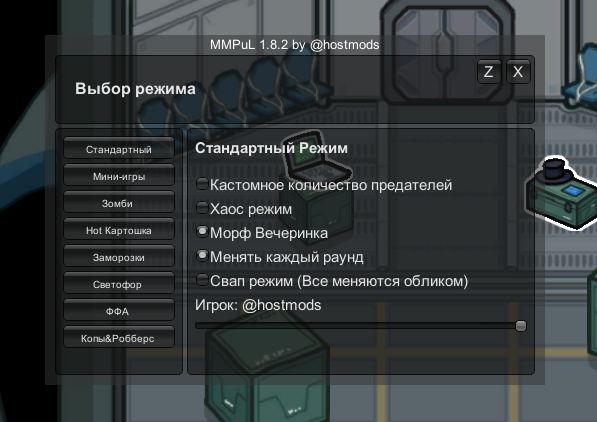

# MMPuL (Multi Mode Public Lobby)

**MMPuL** - является host-only модом без Mod-Protocol что означает для игры мод необходимо устанавливать только хосту лобби а так же что лобби с этим модом будут видны в публичном списке.

С **MMPuL** для вас откроется множество различных режимов и модификаторов к игре.

- **Открыть меню можно на `F3`.**
- **Диапозон настроек рассширен (Например `0.05` минимум для перезарядки убийства вместо привычных `10.00` секунд).**
- **При зажатии клавиши `SHIFT` или `CTRL` и изменении настроек то шаг становиться `0.05` или `1` для настроек без точки.**

___
### 🛠️ Модификаторы для классики:

- Выбор количества предателей от 1 до 15;
- Режим «Хаос»: каждые несколько секунд (зависит от настроек) к случайному игроку применяется случайная `скорость`, `дальность обзора` или `перезарядка убийства`;
- Режим «Морф-Вечеринка»: все превращаются в одного из игроков или меняются обликами (свап-режим).

### Кастомные режимы:

**🧟 Зомби**

- В этом режиме игроки делятся на две команды: мирные и зомби;
- Спустя несколько секунд после начала игры случайный игрок превращается в зомби;
- Зомби должен передавать другим игрокам инфекцию касанием, превращая их в зомби;
- Цель зомби: заразить всех мирных до истечения игрового времени;
- Цель мирных: избежать заражения до истечения игрового времени.

**🥔 Горячая Картошка**

- В начале игры случайному игроку выдаётся горячая картошка;
- Носитель картошки должен передать её другому игроку касанием;
- Спустя _N_ секунд носитель картошки умирает, а картошка выдаётся другому игроку;
- Побеждает последний выживший игрок.

**❄ Заморозки**

- В этом режиме игроки делятся на две команды: мирные и водящие;
- В начале игры случайным образом выбирается от 1 до 3 водящих (зависит от настроек);
- Водящие должны замораживать мирных касанием;
- Мирные игроки умирают спустя _N_ секунд нахождения в заморозке ;
- Мирные должны убегать от водящих и размораживать друг друга касанием;
- Цель водящих: нейтрализовать всех мирных до истечения игрового времени;
- Цель мирных: выжить до истечения игрового времени, помогая команде.

**🚦 Светофор**

- В начале игры всем игрокам выдаётся зелёный цвет и одинаковое количество заданий;
- Со временем цвет игроков будет меняться: с зелёного на желтый, с жёлтого на красный, с красного на зелёный. Частота изменения цвета регулируется в настройках;
- Игрок умирает, если двигается, пока его цвет - красный;
- Побеждает(ют) игрок(и), оставшийся(евся) в живых и выполнивший(шие) все задания.

**🔪 FFA**

- У всех игроков есть возможность убивать других;
- Скорость перезарядки кнопки убийства у всех одинакова и настраивается в ванильном меню настроек лобби;
- Игроки должны убивать друг друга, при этом стараясь выжить;
- Побеждает последний выживший игрок.

**🚓 Копы и Преступники**

- Игроки делятся на две команды: копы и преступники;
- В начале игры случайным образом выбирается от 1 до 3 копов (зависит от настроек);
- Копы должны догонять преступников и касанием отправлять их на случайную вентиляцию;
- Преступники должны убегать от копов, попутно осматривая вентиляции и освобождая друг друга касанием;
- Цель копов: поймать всех преступников до истечения игрового времени;
- Цель преступников: продержаться до истечения игрового времени, помогая команде.

### ⚙️ Опции мода

- Настройка прозрачности меню;
- Немедленно начать и закончить игру;
- Настройка шанса смерти при использовании лестницы
- Возможность разрешить игрокам смену цвета командой `/color`

## ❓ Как установить мод?

1. Скачайте загрузчик модов BepInEx 6.0.0
    - Для **Steam** и **Itch**: [Скачать](https://builds.bepinex.dev/projects/bepinex_be/735/BepInEx-Unity.IL2CPP-win-x86-6.0.0-be.735%2B5fef357.zip)
    - Для **Microsoft Store** и **Epic Games**: [Скачать](https://builds.bepinex.dev/projects/bepinex_be/735/BepInEx-Unity.IL2CPP-win-x64-6.0.0-be.735%2B5fef357.zip)
2. Распаковать скачанный архив в корневую папку игры.
3. Скачать [последний релиз MMPuL](https://github.com/conquerAmongUs/MMPuL/releases/latest) и переместить в: `\BepInEx\plugins`
4. Запустите игру.

**Готово!**

(если что-то пошло не так, обратитесь за помощью в тг-канале: )
